# WE816
The WE816 is a 16-bit 65816 based system with 512K of System RAM, 96K of System ROM, 32K of video RAM, a TMS9918 graphics processor and an AY-3-8910 Sound chip.  The system runs a custom version of BASIC and supports commodore compatible IEC disk drives.

EhBASIC by Lee Davison was ported to the 65816 CPU on the WE816 computer.   It is designed to allow a full 64K bank for BASIC code and variables with the BASIC interpreter running in a totally different bank. Full documentation on the basic intrepreter can be found in the support folder

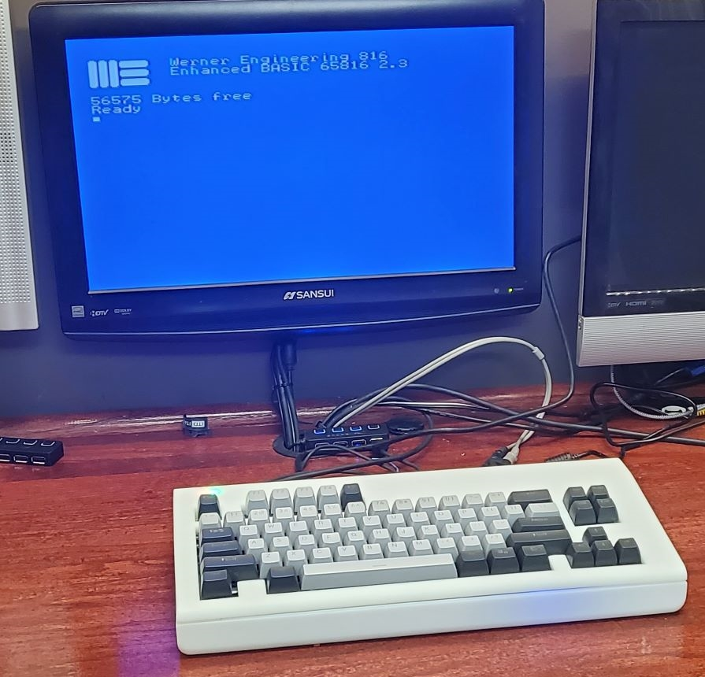
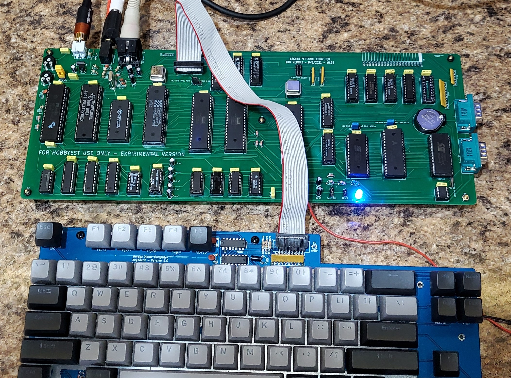

---

## To Do:

* RTC Hardware (fixed needs PCB created and tested)

* BIOS RTC Code

* Basic Access to RTC

* Fix Video RAM paging

* Document BIOS Calls

---

## What is included in this repo?
As of this time, the repo includes

1. The WE816 Mainboard PCB Kicad design and Gerber files
2. The source code and binaries for the WE816 BASIC interpreter
3. The source code and binaries for the WE816 BIOS firmware
4. The source code and binaries for several hardware test programs
5. The logic equasions for the 3 GALs
6. **OpenSCAD and STL files for a 3d printed case

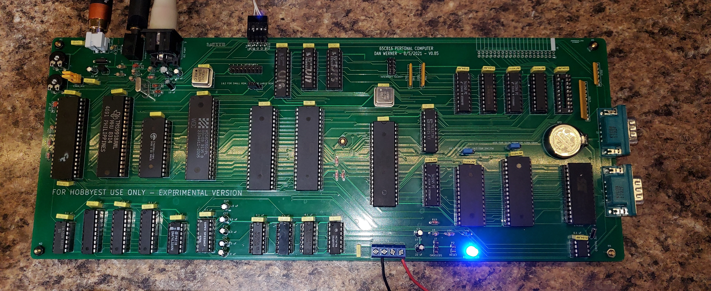
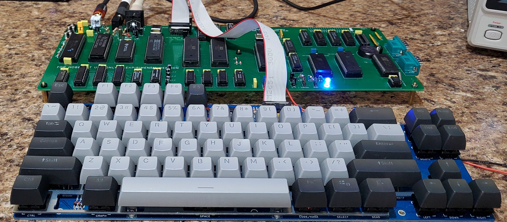

---

## Known Bugs

 * Note that the Real Time clock circuit on the 8/5/2021 .85 verson of the board is broken and will not work.  The schematic in this repo has been updated to a working version, but this board still has U12 Pin 6 & 7  connected to CB1 & 2 of U36 which has a broken shift register implementation.   I was under the mistaken impression that the shift register bug had been corrected on the WDC version of the 6522, but this is not the case.

### System Jumpers

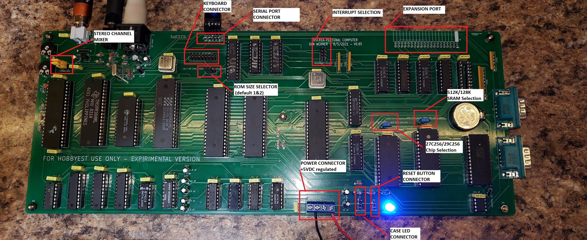

Jumper P9 -- stereo channel mixer

 *  no jumpers, channel a left, channel c right, channel b left and right
 *  1-2 and 2-3 , channel a,b,c mixed to left and right

Jumper K1 - SRAM chip selection

 * 1&2 - 512K chip used (AS6C4008)
 * 2&3 - 128K chip used (AS6C1008)

Jumper K2 - ROM chip selection

 * 1&2 - 27c256 chip used
 * 2&3 - 29c256 chip used

Jumper K3 - ROM size

 * 1&2 - 16K rom page 0 memory map @ $C000
 * 2&3 - 32K rom page 0 memory map @ $8000

Power P1

 * 1- NC
 * 2-GND
 * 3-GND
 * 4-+5VDC 2A Regulated

Reset P2

 * NO Switch (Short to put system in reset)

Jumper J1, Interrupt Select

* 1&8 UART Interrupt enabled
* 2&7 VIA 1 Interrupt enabled
* 3&6 VIA 2 Interrupt enabled
* 4&5 TMS9918 Interrupt enabled

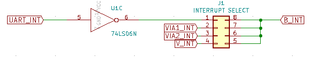

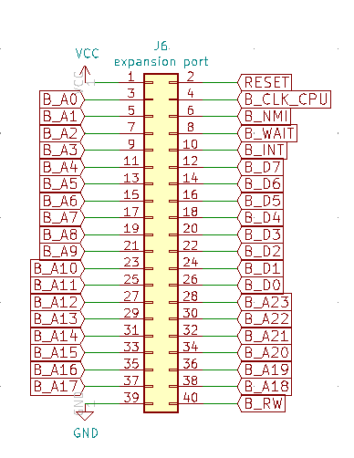

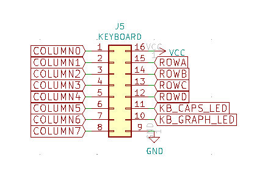

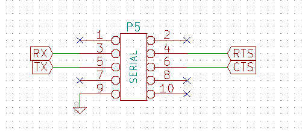

---

## Bill Of Materials

### Mainboard

Qty|Reference(s)|Value
--------|--------|----------
1|BT1|Battery_Cell
35|C1-C33, C37, C49|0.1 uF
2|C34, C35|33 pF
2|C36, C48|22 uF
1|C38|220 uF
5|C39-C43|1.0 uF
2|C44, C45|270 pF
3|C46, C47, C50|10 uF
1||D1|BICOLOR LED
1||J1|Conn_01x02_Male
1||J2|Conn_01x06_Male
1||J3|Conn_02x08_Counter_Clockwise
1||J4|DIN-5
1|J5|Conn_01x03_Male
1|J6|Conn_02x04_Counter_Clockwise
1|J7|Conn_02x20_Odd_Even
1|J8|AudioJack3
2|J9, J10|DB9_Male
1|K1|Conn_01x03_Male
1|K2|Conn_01x03_Male
1|K3|Conn_01x03_Male
1|L1|INDUCTOR (BEAD)
1|P1|Conn_02x05_Odd_Even
1|P2|Conn_02x02_Odd_Even
1|P3|Screw_Terminal_01x02
1|P4|Conn_01x02_Male
1|P5|Oscillator:CXO_DIP8
1|Q1|2N3904
1|R1|0 ohm
1|R2|470 ohm
2|R3, R4|75 ohm
3|R5, R6, R7|1K ohm
4|R8, R9, R10, R18|1K ohm
5|R11, R12, R13, R14, R17|10K ohm
1|R15|100 ohm
1|R16|10 ohm
1|RR1|1K ohm Bussed 6 pin
2|RR2, RR3|4700 ohm Bussed 6 pin
1|RR4|4700 ohm Bussed 10 pin
2|RV1, RV2|4700 ohm variable
1|U1|74LS393
1|U2|7406
1|U3|74LS06N
1|U4|74F14  (should be F)
1|U5|74LS04
1|U6|TMS9918
1|U7|74LS574
2|U8, U9|74LS574
1|U10|RAM_32KO
1|U11|74LS32
2|U12, U14|GAL16V8 (7ns)
1|U13|GAL20V8 (7ns)
1|U15|16550
1|U16|DS1302
1|U17|MAX232
2|U18, U19|W65C22NxP
5|U20, U22, U23, U24, U31|74LS245
1|U21|74LS244
1|U25|AY-3-8910
1|U26|SRAM_512KO
1|U27|658C16
1|U28|27C256
1|U29|27C512
1|U30|74LS373
1|X1|10.7 MHz
1|X2|CXO_DIP8
1|X3|CRYSTAL 32.768 KHz

### Keyboard
The Keyboard used in the WE816 is identical to the keyboard used in Sergey Kiselev's MSX compatible OMEGA computer.  See the Schematics, PCB layout and build instructions
[here](https://github.com/skiselev/omega/blob/master/Keyboard.md)

### Case
The case in the following images is a 3D print manufactured by the 3D print service offered by JLCPCB.com.  The case was originally designed to be 3D printed by a FDM printer such as the Anycubic Chiron.   It was originally intended that threaded inserts be melted into the stand off posts so the diameter of the holes were sized accordingly.  If a printing service (such as JLCPCB) is used that uses resin printing, it is necessary to slightly drill out the holes in the stand offs so that threaded inserts can be glued in.   It should also be noted that the design tolerances are quite tight and variations in printing can mean that some slight adjusting may be needed in order to get a good fit.

A 12V to 5V converter can be seen in the image that was added into the case in order to convert the 12V power input to the 5B required by the main board.

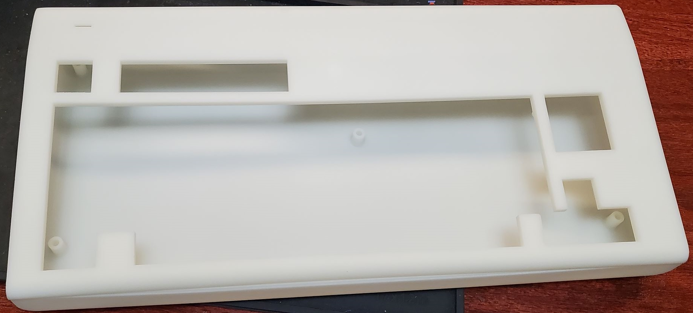
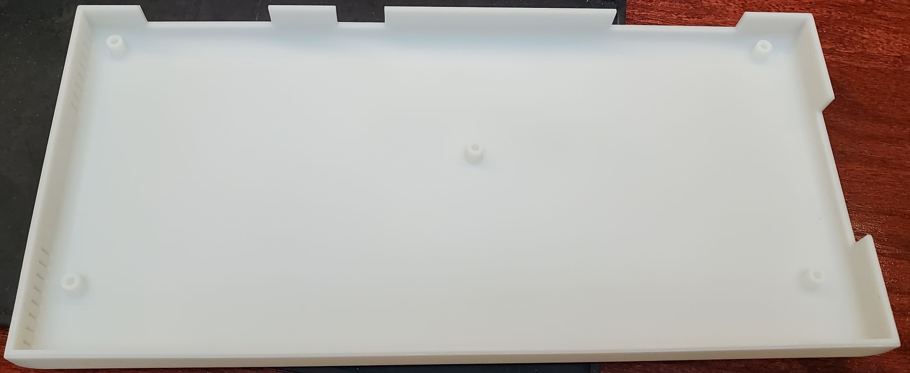
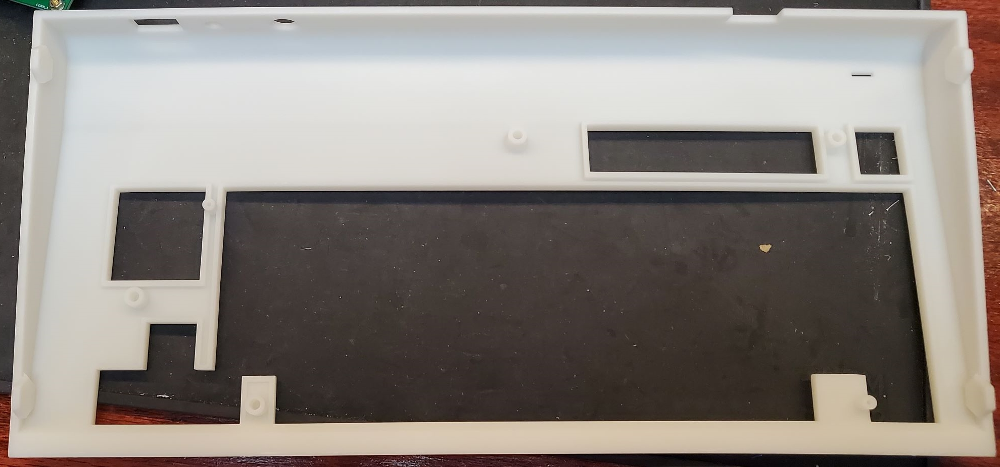
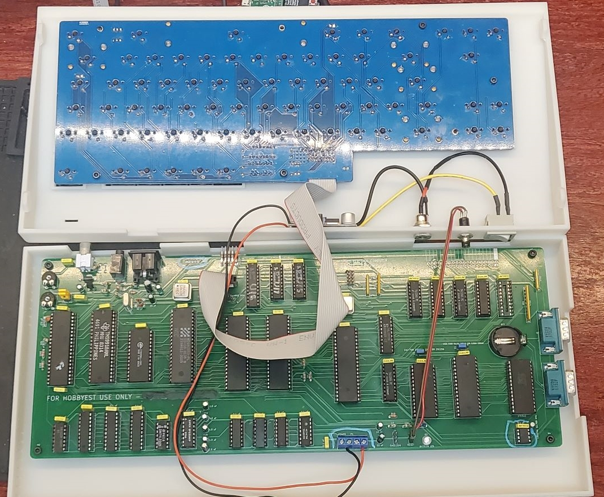
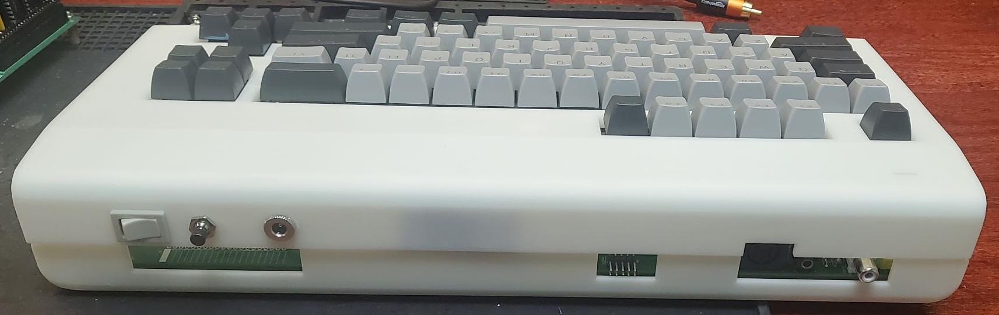

### Questions?

If there are any questions, I can be reached at vic2020Dan at gmail dot com.

---